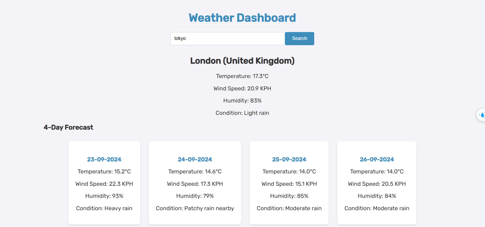

<h1>Command line</h1>
<h3>The application uses Django, to launch:</h3>

``` CmdLine
python manage.py runserver
```

<h1>Test results:</h1>
<h3>+ Completed the Weather Forecast Dashboard.</h3>
<h3>+ Successfully searched and displayed cities around the world.</h3>
<h3>+ Displayed the 4-day weather forecast for the searched city.</h3>



<h1>Limitations:</h1>
<h3>+ The frontend does not fully match the requirements.</h3>
<h3>+ Temporary weather information has not been saved.</h3>
<h3>+ The subscription feature for receiving weather information is not working.</h3>
<h3>+ The application has not been deployed.</h3>